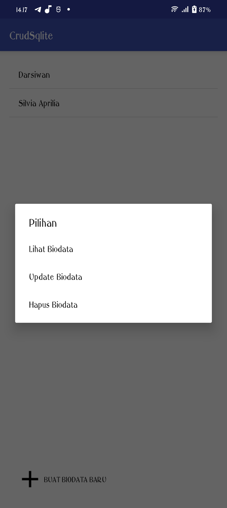
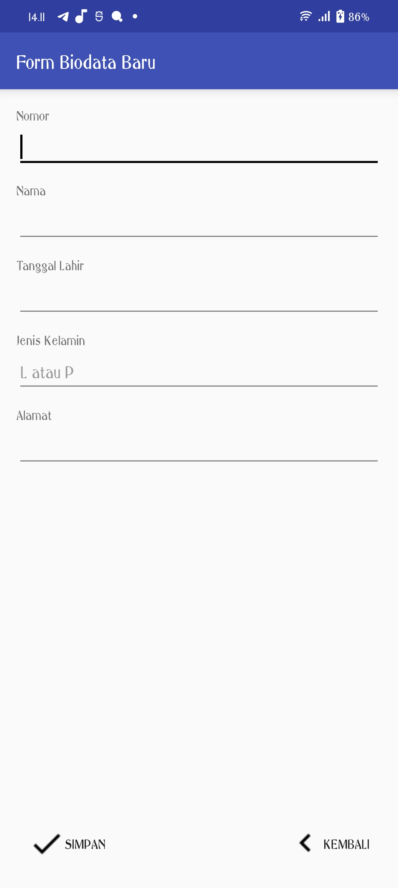
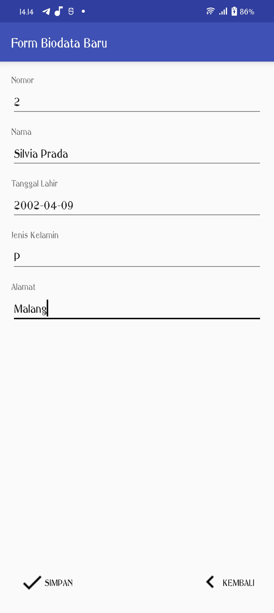
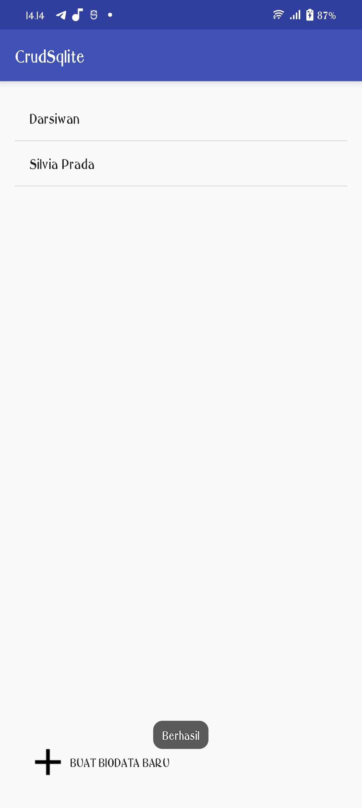
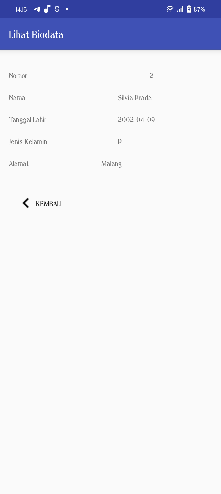
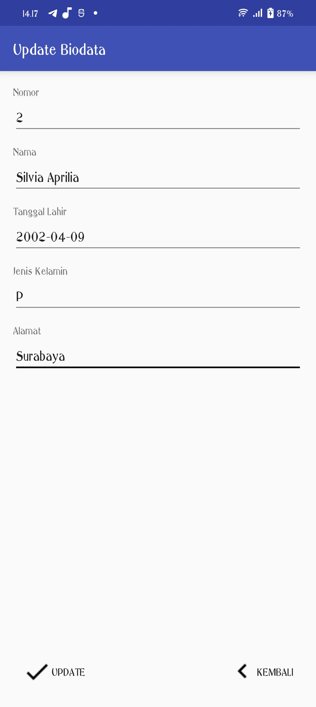
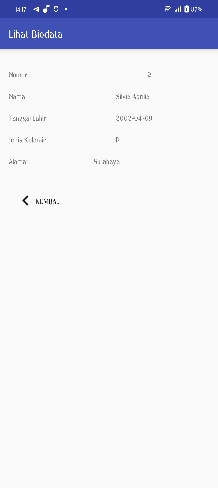

# Laporan Praktikum Pertemuan 5
### Nama : Silvia Prada Aprilia
### NIM : 2041720141
### Kelas : TI-3C
 

1. Mengganti versi dari project untuk menyesuaikan dengan versi terbaru 

2. Melakukan refaktor dan mengganti dependancies

3. Melakukan run project
.png)

4. Hasil tampilan setelah dijalankan

5. Hasil apabila klik data yang sudah ada

6. Hasil apabila klik buat biodata baru

7. Menambahkan data baru

8. Hasil apabila data berhasil ditambahkan

9. Mengupdate data

10. Hasil apabila data berhasil diupdate

11. Menghapus data

